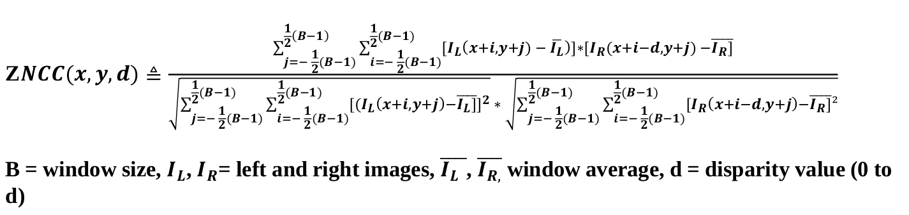
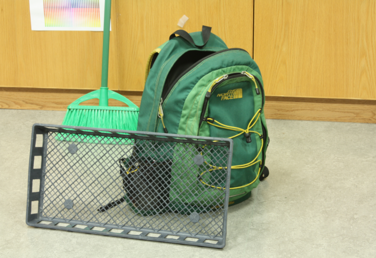
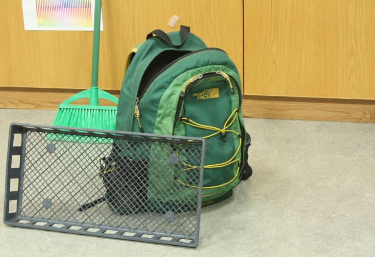
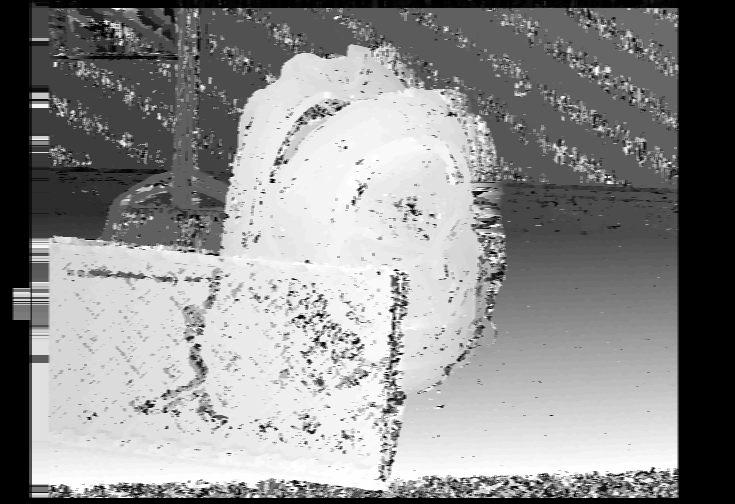
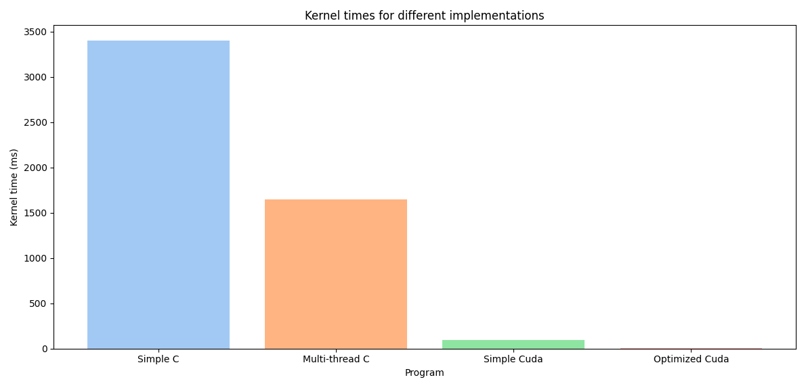

# Cuda optimized disparity map

This repository contains the code for 6 different implementations of the disparity map algorithm. The different implementations are compared to each other.

The depth image is calculated using a disparity map using epipolar geometry with the ZNCC (Zero-Normalized Cross Correlation).

Two images are given as an input that are taken from slightly different positions. The difference between images can be used to approximate depth as objects further away will have less movement and objects closer.

  
  

  

### Comparison

| Program  | Kernel times (ms) |
| ------------- | ------------- |
| Simple C  | 3400  |
| Multi-thread C  | 1600  |
| Simple Cuda | 97 |
| Optimized Cuda | 6.5 |

A naive implementation that only does minimal caching is used in the first three approaches with the -O3 flag. Despite no special optimization the cuda version is significantly faster compared to the Simple C implementation.

##### Data transfers
The data is kept at the GPU memory for different kernels to avoid long transfer times.

##### Caching commonly used values
One of the easiest optimizations had to do with how the algorithm was calculated and had nothing
to do with multi processing. Most importantly, caching the already calculated values that are
independent from the disparity variable d.

##### Loop unrolling
Loop unrolling gave one of the biggest improvements. It simple unrolls the loops to plain code. Some loops did not achieve higher performance with unrolling.

##### Shared memory
Shared memory gave the best improvements. Array of size (32 + FILTER_HALF) * (32 + FILTER_HALF + d_max) was used. Using shared memory allowed to significantly reduce the latency for data accesses.

For future work it should be made sure that memory accesses are coalesced for global memory and that shared memory reads do not cause bank conflicts.

A mobile implementation using Vulkan compute shaders can be found from https://github.com/tvaranka/vulkan_android_example_depth.
